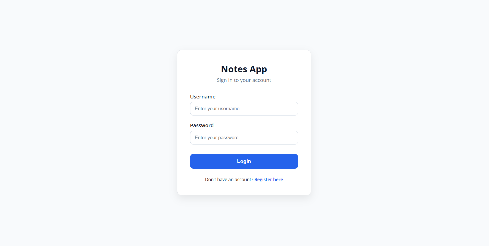
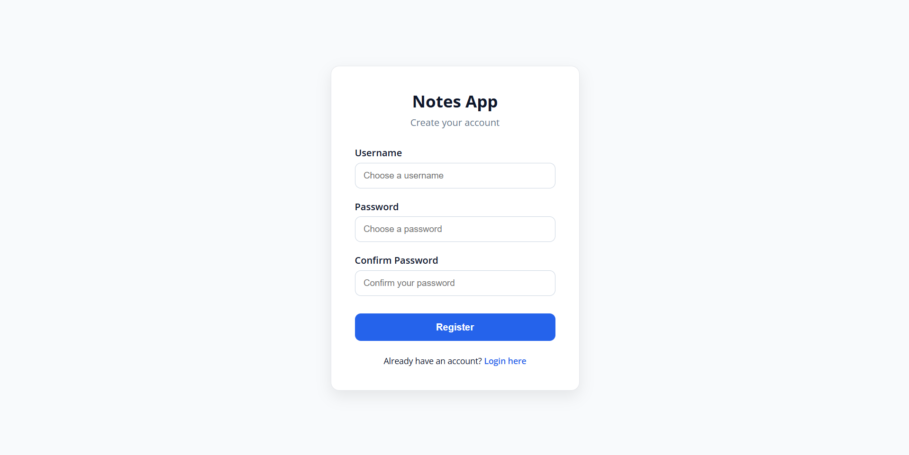
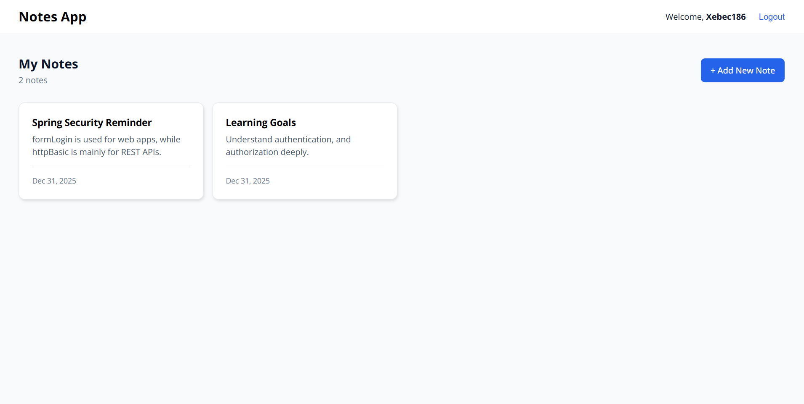
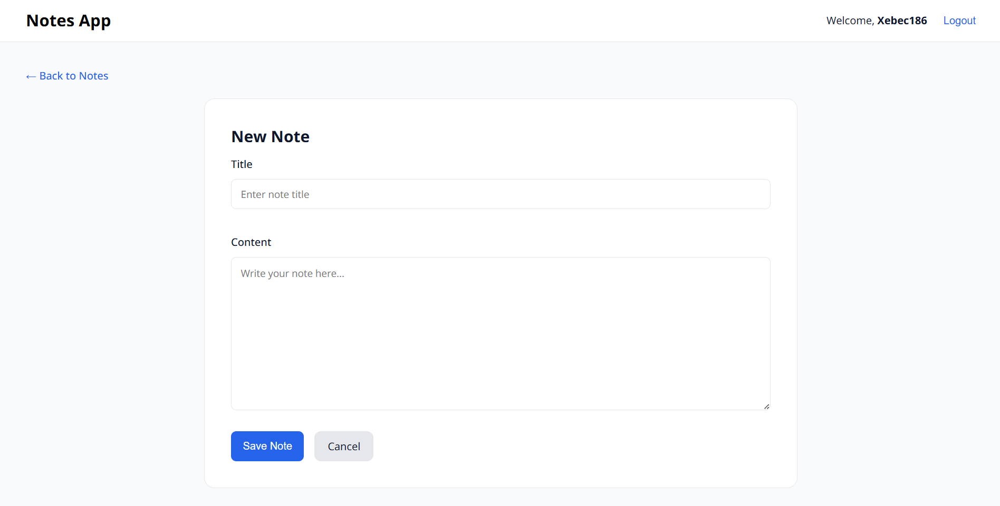
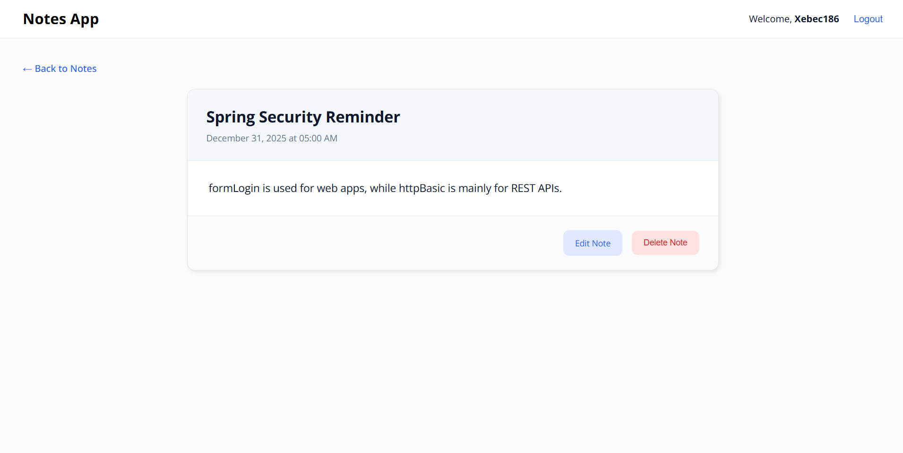
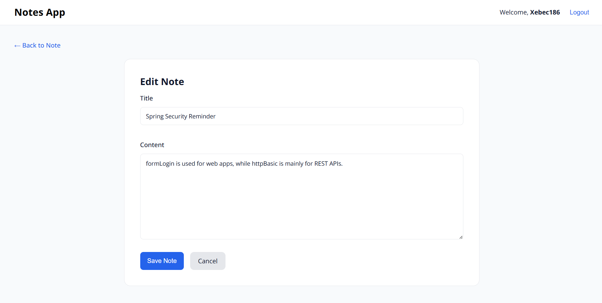

# Notes App 📝

A simple **Spring Boot Notes Application** with user authentication.  
Users can register, log in, and manage their own notes securely.

## Features
- User registration & login
- Spring Security authentication
- Per-user note access
- Create, view, edit, delete notes
- Thymeleaf server-side rendering

## Screenshots

### Login

### Register

### Notes Dashboard

### Add Note Page

### Note Page

### Edit Note Page

## Tech Stack
- Java + Spring Boot
- Spring Security
- Spring Data JPA
- Thymeleaf
- HTML & CSS
- H2 Database

## Future Improvements
- Search and filter notes
- Note categories / tags
- Rich text editor for notes
- Pagination for large note lists
- User profile management
- Password reset & email verification
- ~~REST API version for frontend frameworks (React)~~
- REST API Documentation
- Improved UI responsiveness (mobile support)
